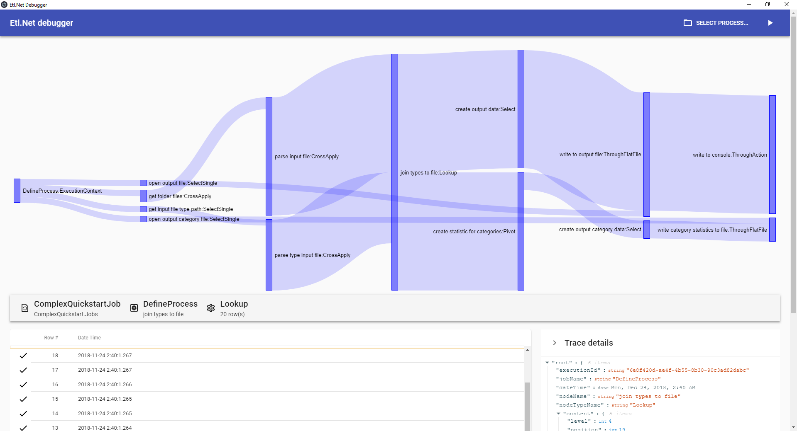

# Etl.Net [](https://gitter.im/Etl-Net/Lobby?utm_source=badge&utm_medium=badge&utm_campaign=pr-badge&utm_content=badge)

> **:beers: This is May 2021, Etl.Net is now ready for release to be used in production environments but we are working on a basic documentation to finally publish this release with incredible new features after 2 years and half of efforts. Still a bit of patience!**

|V2|develop|master|
|-|-|-|
|  |  |  |
| | [](https://ci.appveyor.com/project/paillave/etl-net-vyqub) | [](https://ci.appveyor.com/project/paillave/etl-net) |
| | [](https://bettercodehub.com) |[](https://bettercodehub.com) |
| | |[](https://app.fossa.com/projects/git%2Bgithub.com%2Fpaillave%2FEtl.Net?ref=badge_shield) |

Implementation of a multi platform reactive ETL for .net standard 2.0 working with a similar principle than SSIS, but that is used in the same way than Linq.
The reactive approach for the implementation of this engine ensures parallelized multi streams, high performances and low memory foot print even with million rows to process.

| Package | nuget version | nuget downloads |
|-|-|-|
| Etl.Net | [](https://www.nuget.org/packages/Etl.Net) |[](https://www.nuget.org/packages/Etl.Net) |
| Etl.Net.EntityFrameworkCore | [](https://www.nuget.org/packages/Etl.Net.EntityFrameworkCore) |[](https://www.nuget.org/packages/Etl.Net.EntityFrameworkCore) |
| Etl.Net.TextFile | [](https://www.nuget.org/packages/Etl.Net.TextFile) |[](https://www.nuget.org/packages/Etl.Net.TextFile) |
| Etl.Net.XmlFile | [](https://www.nuget.org/packages/Etl.Net.XmlFile) |[](https://www.nuget.org/packages/Etl.Net.XmlFile) |
| Etl.Net.Ftp | [](https://www.nuget.org/packages/Etl.Net.Ftp) |[](https://www.nuget.org/packages/Etl.Net.Ftp) |
| Etl.Net.Sftp | [](https://www.nuget.org/packages/Etl.Net.Sftp) |[](https://www.nuget.org/packages/Etl.Net.Sftp) |
| Etl.Net.ExcelFile | [](https://www.nuget.org/packages/Etl.Net.ExcelFile) |[](https://www.nuget.org/packages/Etl.Net.ExcelFile) |
| Etl.Net.SqlServer | [](https://www.nuget.org/packages/Etl.Net.SqlServer) |[](https://www.nuget.org/packages/Etl.Net.SqlServer) |
| Etl.Net.ExecutionPlan | [](https://www.nuget.org/packages/Etl.Net.ExecutionPlan) |[](https://www.nuget.org/packages/Etl.Net.ExecutionPlan) |

[](https://app.fossa.com/projects/git%2Bgithub.com%2Fpaillave%2FEtl.Net?ref=badge_large)

## Development status :construction:

> :warning: This library is still under development, don't use it on production environment yet as its api structure is subject for changes. This explains its alpha version.
> The first beta release is expected once it starts to be a decent candidate to replace SSIS for common use cases, and when common bugs are solved.

## Documentation :construction:

The full (ongoing) documentation is on the website of Etl.Net: https://paillave.github.io/Etl.Net/

Main recipes are on the page https://paillave.github.io/Etl.Net/recipes.

> :warning: Documentation is still under construction.

## ETL features

### Implemented

Select, Where, Sort, Left Join, Lookup, Union, Union All, Skip, Top, Distinct, Pivot, Unpivot, Aggregate, Cross Apply, Ensure Sorted, Ensure Keyed, Script, Run subprocess, Keep section, Ignore section, List folder files, Read csv file, Read excel file, Write csv file, Write excel file, Read from Entity framework core, Write to Entity framework core, Entity framework core upsert, SQL Server bulk load, Read from sql server command, Write to sql server command, List files from FTP, Read file from FTP, Write file to FTP, List file from SFTP, Read file from SFTP, Write file to SFTP, read very large xml file, ...

Check evolution of developments in [the projects section](https://github.com/paillave/Etl.Net/projects)

### To be coming

Read very large json file, Read from Entity framework, Write to Entity framework, Read from MongoDb, Write to MongoDb, MongoDb upsert, Entity framework upsert, Read data from REST service, Write data to REST service...

> [!NOTE]
> Follow the status in the issue section
> 
> New requests are very welcome in the issue section

## Runtime features

### Implemented

Trace issued data by each node, Trace any error, Stop the entire process whenever an error is raised, Trace statistic result of each node at the end of the process, Execute any ETL process on traces to filter and save them, Show real time process execution statistics...

### To be coming

Trace time that is spent in each node at the end of the process, Publish a Job as a REST web service in web api core, Execute a job using reference to native .net core configuration, Web portal to host job definitions and manage their executions, Power shell command tool to execute a job, Visual studio code addon to view the process whenever the job definition class file is saved, Raise a warning on the risky node when a performance issue or a bad practice is detected given statistics, Interprets a T-SQL-like language script to build a job definition on the fly and run it...

> [!NOTE]
> New requests are very welcome in the [issue section](https://github.com/paillave/Etl.Net/issues)

## Debugger

The debugger show the process as a sankey graph to visually represent what it makes. This debugger will permit to run a process and see in detail data went through process nodes.

[Download the debugger](https://github.com/paillave/Etl.Net-Debugger/releases)

[Learn how to use the debugger](https://github.com/paillave/Etl.Net-Debugger)



## Simple Quickstart :suspect:

```csharp
using Paillave.Etl;
using System;
using System.IO;
using Paillave.Etl.Core;
using Paillave.Etl.TextFile.Core;
using Paillave.Etl.Core.Streams;

namespace SimpleQuickstart
{
    public class SimpleConfig
    {
        public string InputFilePath { get; set; }
        public string OutputFilePath { get; set; }
    }

    public class SimpleQuickstartJob
    {
        public static void DefineProcess(IStream<SimpleConfig> rootStream)
        {
            var outputFileS = rootStream.Select("open output file", i => new StreamWriter(i.OutputFilePath));
            rootStream
                .CrossApplyTextFile("read input file",
                    FileDefinition.Create(
                        i =>
                        {
                            Id = i.ToColumn<int>("#"),
                            Name = i.ToColumn<string>("Label"),
                            CategoryCode = i.ToColumn<string>("Category")
                        }).IsColumnSeparated('\t'),
                    i => i.InputFilePath)
                .ToAction("Write input file to console", i => Console.WriteLine($"{i.Id}-{i.Name}-{i.CategoryCode}"))
                .Pivot("group and count", i => i.CategoryCode, i => new { Count = AggregationOperators.Count() })
                .Select("create output row", i => new CategoryStatisticFileRow { CategoryCode = i.Key, Count = i.Aggregation.Count })
                .Sort("sort output values", i => new { i.CategoryCode })
                .ToTextFile("write to text file", outputFileS, FileDefinition.Create(i =>
                {
                    CategoryCode = i.ToColumn<string>("Category"),
                    Count = i.ToColumn<int>("Total")
                }));
        }
    }
    class Program
    {
        static void Main(string[] args)
        {
            var testFilesDirectory = @"XXXXXXXXXXXX\Etl.Net\src\TestFiles";

            StreamProcessRunner.Create<SimpleConfig>(SimpleQuickstartJob.DefineProcess).ExecuteAsync(new SimpleConfig
            {
                InputFilePath = Path.Combine(testFilesDirectory, "simpleinputfile.csv"),
                OutputFilePath = Path.Combine(testFilesDirectory, "simpleoutputfile.csv")
            }, null).Wait();
            Console.WriteLine("Press a key...");
            Console.ReadKey();
        }
    }
}
```

## Complex Quickstart :feelsgood:

### Create configuration type

```csharp
using System;
using System.Collections.Generic;
using System.IO;
using System.Text;

namespace ComplexQuickstart.StreamTypes
{
    public class MyConfig
    {
        public string InputFolderPath { get; set; }
        public string InputFilesSearchPattern { get; set; }
        public string TypeFilePath { get; set; }
        public string DestinationFilePath { get; internal set; }
        public string CategoryDestinationFilePath { get; internal set; }
    }
}
```

### Create input and output stream structures

```csharp
using System;
using System.Globalization;
using Paillave.Etl.TextFile.Core;

namespace ComplexQuickstart.StreamTypes
{
    public class InputFileRow
    {
        public int Id { get; set; }
        public DateTime Col1 { get; set; }
        public decimal Col2 { get; set; }
        public int Col3 { get; set; }
        public string Col4 { get; set; }
        public int TypeId { get; set; }
        public string FileName { get; set; }
    }

    public class InputFileRowMapper : FileDefinition<InputFileRow>
    {
        public InputFileRowMapper()
        {
            CultureInfo ci = CultureInfo.CreateSpecificCulture("en-GB");
            ci.DateTimeFormat.FullDateTimePattern = "yyyy-MM-dd HH:mm:ss";
            ci.DateTimeFormat.LongDatePattern = "yyyy-MM-dd";
            ci.DateTimeFormat.ShortDatePattern = "yyyy-MM-dd";

            ci.DateTimeFormat.FullDateTimePattern = "yyyy-MM-dd HH:mm:ss";
            ci.DateTimeFormat.LongDatePattern = "yyyy-MM-dd";
            ci.DateTimeFormat.ShortDatePattern = "yyyy-MM-dd";

            ci.NumberFormat.NumberDecimalSeparator = ",";
            ci.NumberFormat.CurrencyDecimalSeparator = ",";
            ci.NumberFormat.PercentDecimalSeparator = ",";

            this.WithCultureInfo(ci);
            this.MapColumnToProperty("#", i => i.Id);
            this.MapColumnToProperty("DateTime", i => i.Col1);
            this.MapColumnToProperty("Value", i => i.Col2);
            this.MapColumnToProperty("Rank", i => i.Col3);
            this.MapColumnToProperty("Comment", i => i.Col4);
            this.MapColumnToProperty("TypeId", i => i.TypeId);
            this.IsColumnSeparated('\t');
        }
    }
}
```

```csharp
using System.Globalization;
using Paillave.Etl.TextFile.Core;

namespace ComplexQuickstart.StreamTypes
{
    public class TypeFileRow
    {
        public int Id { get; set; }
        public string Name { get; set; }
        public string Category { get; set; }
        public string FileName { get; set; }
    }

    public class TypeFileRowMapper : FileDefinition<TypeFileRow>
    {
        public TypeFileRowMapper()
        {
            CultureInfo ci = CultureInfo.CreateSpecificCulture("en-GB");
            ci.DateTimeFormat.FullDateTimePattern = "yyyy-MM-dd HH:mm:ss";
            ci.DateTimeFormat.LongDatePattern = "yyyy-MM-dd";
            ci.DateTimeFormat.ShortDatePattern = "yyyy-MM-dd";

            ci.DateTimeFormat.FullDateTimePattern = "yyyy-MM-dd HH:mm:ss";
            ci.DateTimeFormat.LongDatePattern = "yyyy-MM-dd";
            ci.DateTimeFormat.ShortDatePattern = "yyyy-MM-dd";

            ci.NumberFormat.NumberDecimalSeparator = ",";
            ci.NumberFormat.CurrencyDecimalSeparator = ",";
            ci.NumberFormat.PercentDecimalSeparator = ",";

            this.WithCultureInfo(ci);
            this.MapColumnToProperty("#", i => i.Id);
            this.MapColumnToProperty("Label", i => i.Name);
            this.MapColumnToProperty("Category", i => i.Category);
            this.IsColumnSeparated('\t');
        }
    }
}
```

```csharp

using Paillave.Etl.TextFile.Core;

namespace ComplexQuickstart.StreamTypes
{
    public class OutputFileRow
    {
        public string FileName { get; set; }
        public int Id { get; set; }
        public string Name { get; set; }
    }

    public class OutputFileRowMapper : FileDefinition<OutputFileRow>
    {
        public OutputFileRowMapper()
        {
            this.MapColumnToProperty("Id", i => i.Id);
            this.MapColumnToProperty("Name", i => i.Name);
            this.MapColumnToProperty("FileName", i => i.FileName);
            this.IsColumnSeparated(',');
        }
    }
}
```

```csharp

using Paillave.Etl.TextFile.Core;

namespace ComplexQuickstart.StreamTypes
{
    public class OutputCategoryRow
    {
        public string Category { get; set; }
        public int TotalAmount { get; set; }
        public int AmountOfEntries { get; set; }
    }
    public class OutputCategoryRowMapper : FileDefinition<OutputCategoryRow>
    {
        public OutputCategoryRowMapper()
        {
            this.MapColumnToProperty("Category", i => i.Category);
            this.MapColumnToProperty("Nb", i => i.AmountOfEntries);
            this.MapColumnToProperty("Tot", i => i.TotalAmount);
            this.IsColumnSeparated(',');
        }
    }
}
```

### Define the ETL job

```csharp
using ComplexQuickstart.StreamTypes;
using System.IO;
using Paillave.Etl;
using Paillave.Etl.Core.Streams;
using System;

namespace ComplexQuickstart.Jobs
{
    public class ComplexQuickstartJob
    {
        public static void DefineProcess(IStream<MyConfig> rootStream)
        {
            var outputFileResourceS = rootStream.Select("open output file", i => new StreamWriter(i.DestinationFilePath));
            var outputCategoryResourceS = rootStream.Select("open output category file", i => new StreamWriter(i.CategoryDestinationFilePath));

            var parsedLineS = rootStream
                .CrossApplyFolderFiles("get folder files", i => i.InputFolderPath, i => i.InputFilesSearchPattern)
                .CrossApplyTextFile("parse input file", new InputFileRowMapper(), (i, p) => { p.FileName = i; return p; });

            var parsedTypeLineS = rootStream
                .Select("get input file type path", i => i.TypeFilePath)
                .CrossApplyTextFile("parse type input file", new TypeFileRowMapper());

            var joinedLineS = parsedLineS
                .Lookup("join types to file", parsedTypeLineS, i => i.TypeId, i => i.Id, (l, r) => new { l.Id, r.Name, l.FileName, r.Category });

            var categoryStatistics = joinedLineS
                .Pivot("create statistic for categories", i => i.Category, i => new { Count = AggregationOperators.Count(), Total = AggregationOperators.Sum(i.Id) })
                .Select("create output category data", i => new OutputCategoryRow { Category = i.Key, AmountOfEntries = i.Aggregation.Count, TotalAmount = i.Aggregation.Total })
                .ToTextFile("write category statistics to file", outputCategoryResourceS, new OutputCategoryRowMapper());

            joinedLineS.Select("create output data", i => new OutputFileRow { Id = i.Id, Name = i.Name, FileName = i.FileName })
                .ToTextFile("write to output file", outputFileResourceS, new OutputFileRowMapper())
                .ToAction("write to console", i => Console.WriteLine($"{i.FileName}:{i.Id}-{i.Name}"));
        }
    }
}
```

### Execute the ETL job

```csharp
using Paillave.Etl;
using System.IO;
using Paillave.Etl.Core.Streams;
using System;
using Paillave.Etl.TextFile.Core;
using ComplexQuickstart.Jobs;
using ComplexQuickstart.StreamTypes;
using Paillave.Etl.Core;

namespace ComplexQuickstart
{
    class Program
    {
        static void Main(string[] args)
        {
            var runner = StreamProcessRunner.Create<MyConfig>(ComplexQuickstartJob.DefineProcess);
            Action<IStream<TraceEvent>> traceStreamProcessDefinition = traceStream => traceStream.ThroughAction("logs to console", Console.WriteLine);
            var testFilesDirectory = @"XXXXXXXXXXXXXXXX\Etl.Net\src\TestFiles";
            var task = runner.ExecuteAsync(new MyConfig
            {
                InputFolderPath = Path.Combine(testFilesDirectory, @"."),
                InputFilesSearchPattern = "testin.*.csv",
                TypeFilePath = Path.Combine(testFilesDirectory, @"ref - Copy.csv"),
                DestinationFilePath = Path.Combine(testFilesDirectory, @"outfile.csv"),
                CategoryDestinationFilePath = Path.Combine(testFilesDirectory, @"categoryStats.csv")
            }, traceStreamProcessDefinition);

            Console.WriteLine("Done");
            Console.WriteLine("Press a key...");
            Console.ReadKey();
        }
    }
}
```
