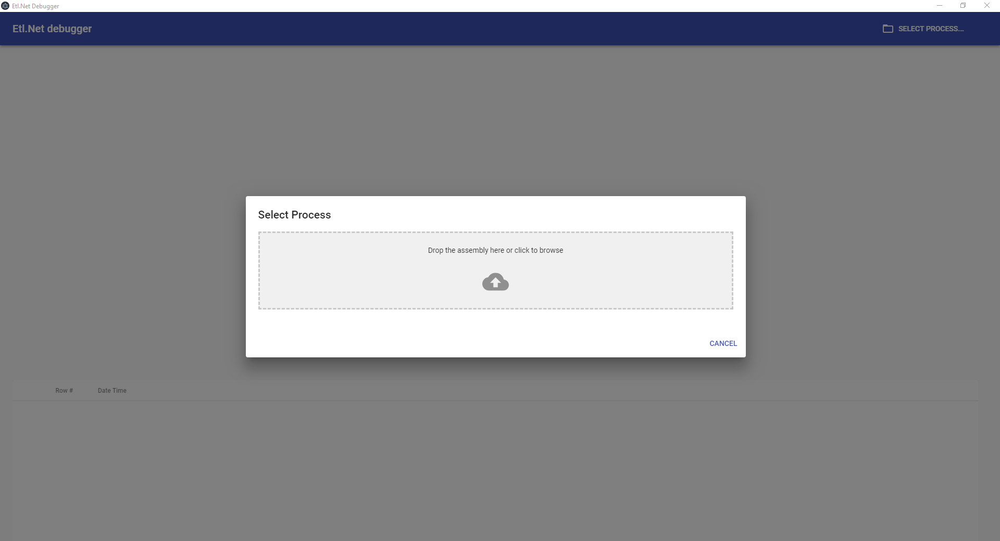
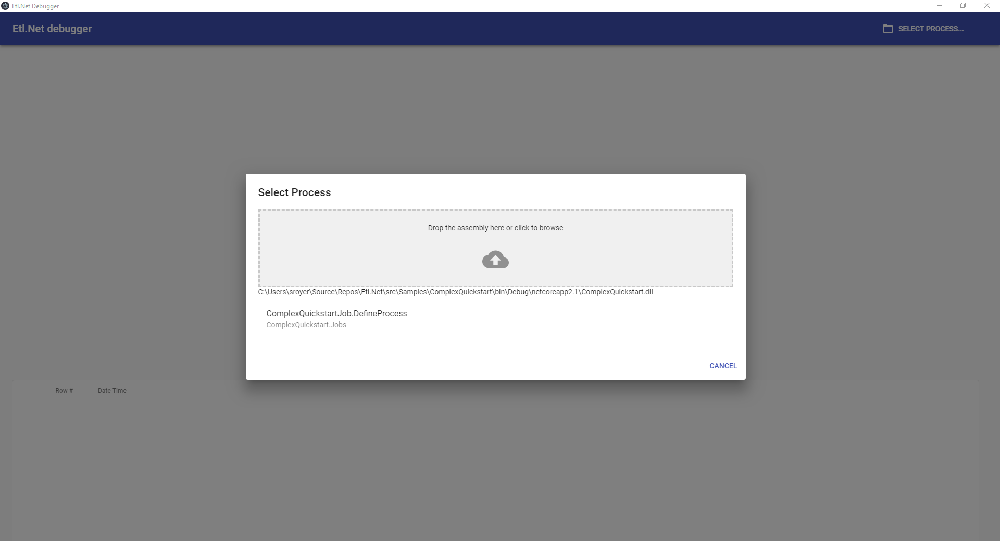
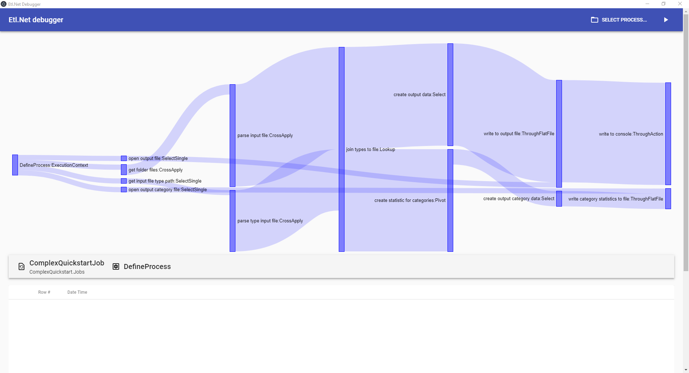
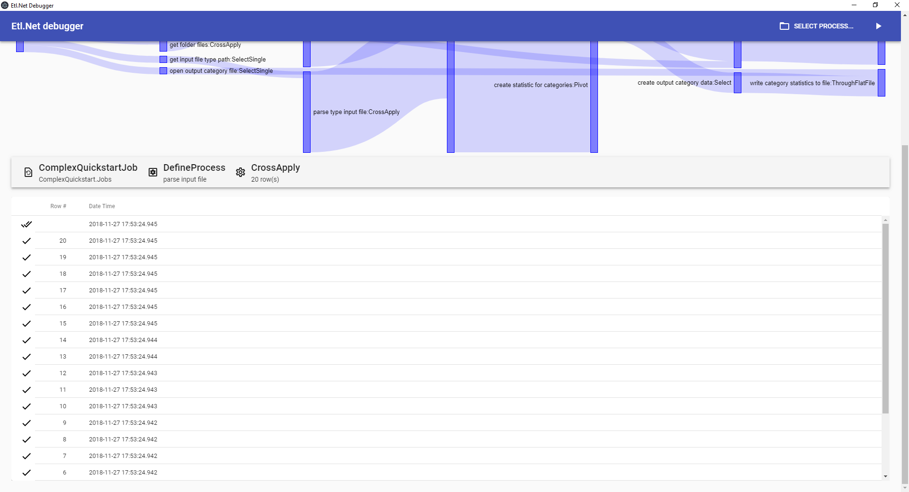
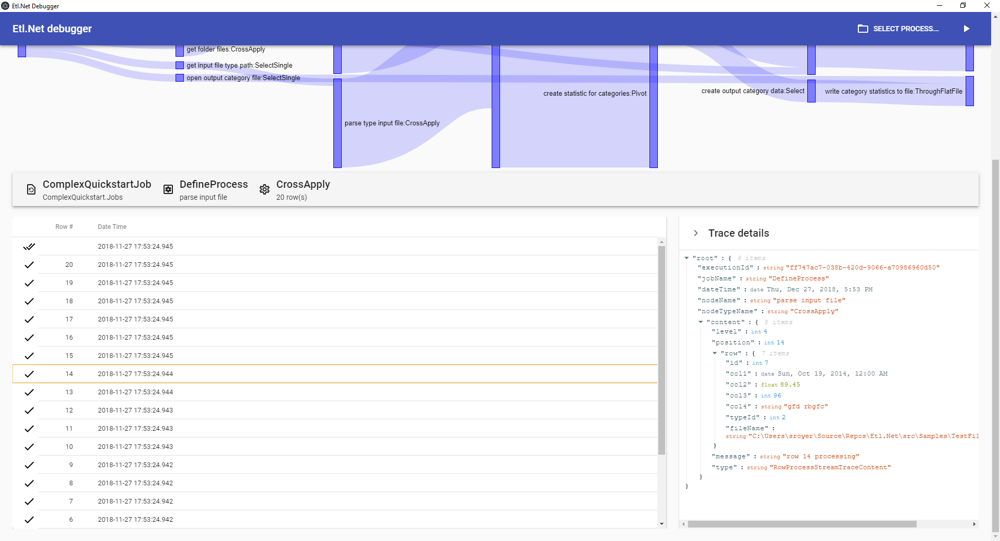

# Etl.Net Debugger

Tool to debug Etl.Net processes.

[Download](https://github.com/paillave/Etl.Net-Debugger/releases)

## Features

- View the list of process descriptions in an assembly
- View the detailed description of a process
- Execute a process by providing its input values
- View rows issued by each node of the process
- View the detail of a row issued by a node of the process

## How to use Etl.Net Debugger

### Open the application `electron.net.host.exe`

The application takes a little while to open and there is no splash screen at the moment. It shows an empty screen awaiting the user to select a process.


### Click on `SELECT PROCESS`

This will show a form for the user to select an assembly and a process.


### Drag and drop the assembly that contains the process on the dedicated area

This will show the list of processes contained in the selected assembly.
> [!NOTE]
> Processes must be static methods with this signature:
> ``` CSharp
> public static void AnyMethodName(ISingleStream<AnyClassType> rootStream)
> ```



### Click on the process that must be executed or verified

This will show the detailed structure of the selected process.


### Click on `RUN` (the play icon at the right of `SELECT PROCESS`)

This will show a form were values of properties of the input config type can be given.

> [!NOTE]
> Type that are not natively serializable in .net will cause a failure for execution. To run such a process, create a dedicated process that wraps this process.


### Click on `EXECUTE`

This will run the process by providing real time evolution of the process. The quantity of rows issued by each node will impact the thickness of the matching stream representation.

> [!NOTE]
> Errors in the process execution are not properly handled yet in this version.



### Click on a node

This will show the list of events issued by this node, including issued rows.



### Click on a row

This will show the detail of the trace (including the content of the issued row).


