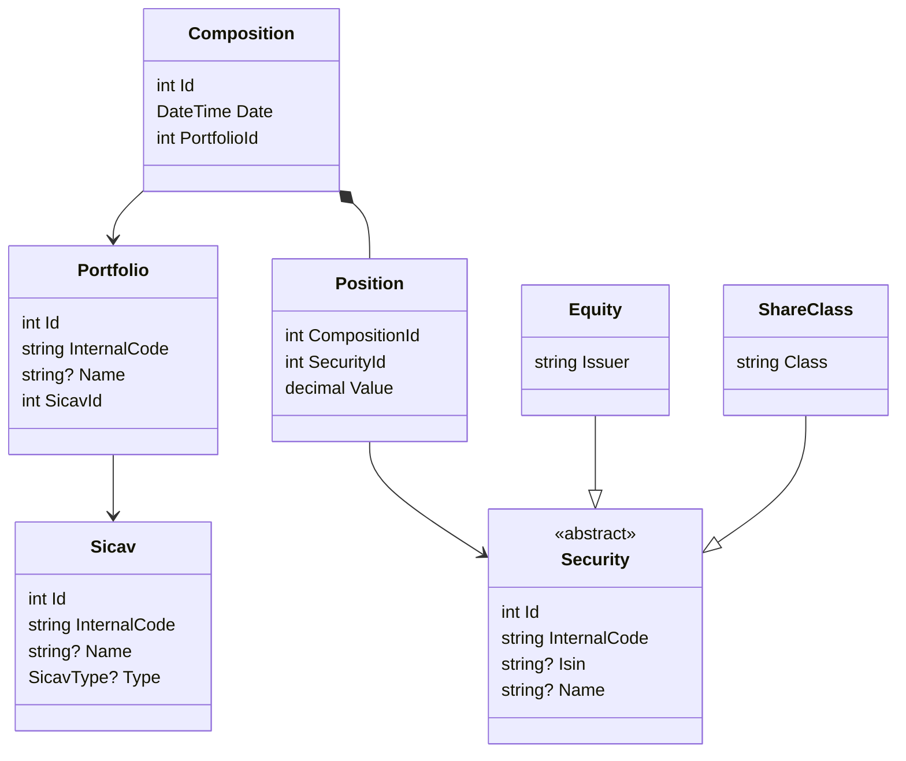

```mermaid
classDiagram
class Sicav {
    int Id
    string InternalCode
    string? Name
    SicavType? Type
}
class Portfolio {
    int Id
    string InternalCode
    string? Name
    int SicavId
}
class Security {
<<abstract>>
    int Id
    string InternalCode
    string? Isin
    string? Name
}
class Equity {
    string Issuer
}
class ShareClass {
    string Class
}
class Composition {
    int Id
    DateTime Date
    int PortfolioId
}
class Position {
    int CompositionId
    int SecurityId
    decimal Value
}
Position --> Security
Composition --> Portfolio
Composition *-- Position
Equity --|> Security
ShareClass --|> Security
Portfolio --> Sicav
```
